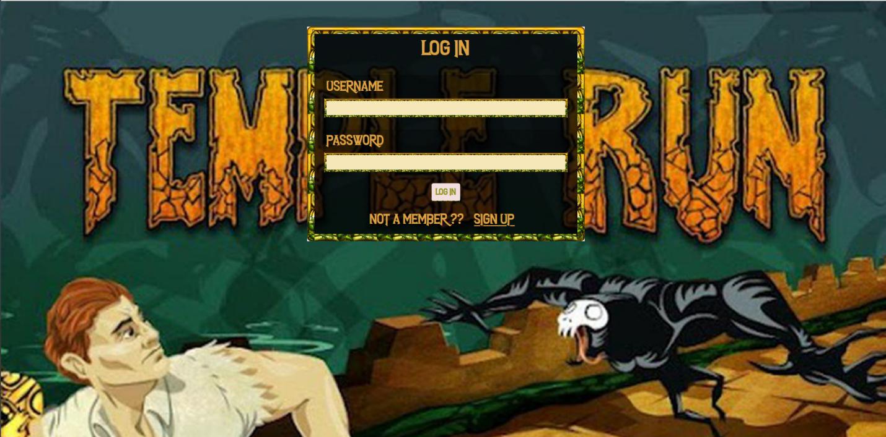

# Game_Portal

In this project  I have tried  to maintain a temple run database regarding it which contain information as player its score details and the rewards the player achieves. It also contain information like game characters , his/her name , special ability and  the  different game map . The project includes various character opt by the player  and  choosing different game map and its respective scores and ranks in the database.

